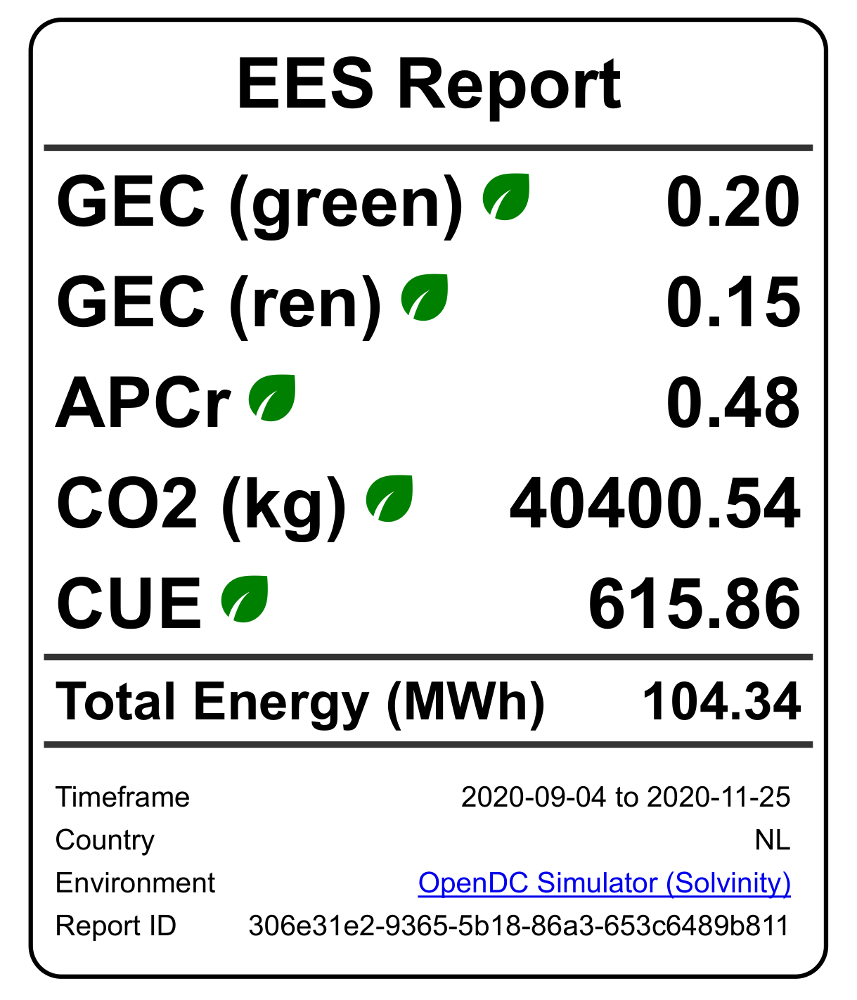

# Quick Start

In this section we provide a quick overview of how to get started with EESR. A more complete example of its usage can be seen in [this ](https://github.com/philippsommer27/experiments-bsc-thesis-2022)repository.

## Installing

EESR is available as a python package installable through PiP with the following command:

```
pip install opendc-eesr
```

Once installed, the module can be imported into any python project or Jupyter Notebook with:

```python
import eesr
```

With the module imported, you can now make use of the various classes and functions in the grid analysis module and the report generation module. The following two sections cover how to perform a basic analysis and create a report given an OpenDC energy trace.

## Grid Analysis

Within EESR's interface module there helper functions for performing the common tasks of EESR. We can import this interface with:

```python
from eesr import interface
```

The analysis is performed on an energy trace. That is, a tabular data source that has columns `timestamp`, `dc_power_total`, and `it_power_total`. The analysis module accepts a pandas data frame with the timestamp column type being pandas `datetime`.

Using the `opendc_grid_analysis` function from the `interface` module, we can produce the results we need with just one function. The function takes as parameters:

* `dc_path` : the path to the OpenDC trace
* `key_path` : the path to a .txt file containing the ENTSO-E api key code
* `start` : the start time from which the analysis should be performed
* `country` : the country which the analysis should assume the DC exists in
* `out` : path of where to write the results file to
* `tz` :  the time zone to use for the timestamps

Once given all these arguments, the function will preprocess the OpenDC trace into the correct pandas data frame and carry out the grid analysis by calling the `analyze` function of the analysis module. It returns a data frame which is a trace of grid and sustainability related data for every timestamp of the DC's operation. This is useful for further analysis beyond what is provided in the results file.&#x20;

The primary result of the analysis is a .json file containing metrics and metadata conforming to the [sustainability reporting profile](../library/reporting-profiles/sustainability-0.1.md).

## Report Generation

With the results obtained we can now easily produce a report. For the sake of simplicity we will demonstrate reporting in the [compact format](../library/report-templates/compact.md). The `interface` module conveniently provides a `generate_compact_profile` function for doing exactly this. It has as arguments:

* `data_path` : the path of the results matching the input file schema
* `profile_name` : selector for which [reporting profile](../library/reporting-profiles/) to generate the report for
* `generate_domain` : boolean to determine whether domain specific information should be included in report (useful for adding additional information that is not featured in the profile)
* `path` : the path to which to write the report to

Calling the function will run any necessary validation, generate the various components of the report and produce an html file at the designated location. From there, we can call the `to_image` or `to_pdf` functions to convert to a different file format.

The final report should look something like:

<figure><figcaption></figcaption></figure>
